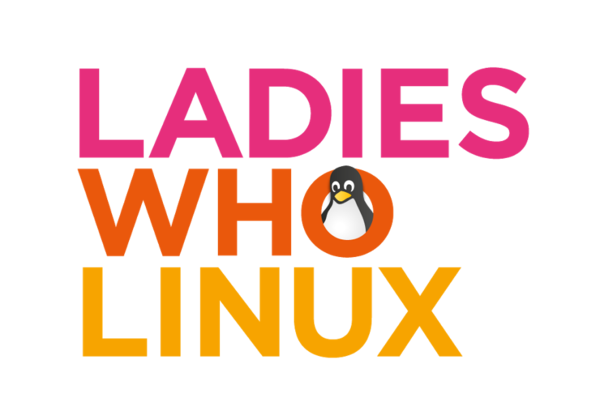

# Ladies Who Linux

## Workshops:
[Linux Bootcamp: From Casual Linux User to Kernel Hacker](workshop)

Below is basically a brain dump first draft of things we'd like to cover. Remove me later

## Laying the foundations
1. Introduction - All
    * Linux history
    * Linux distributions
    * Who uses Linux and why? (space centre)
    * How does Linux get updated?
        * Explanation of patches + mailing list etc.
    * Linux terminology?

1. Boot Process - Georgi
    * Boot sequence steps
        * BIOS
        * MBR
        * Boot Loader
        * Kernel
        * Inital RAM
        * init
        * X Windows
    * Shutdown/reboot

1. Linux Filesystem - Jessie
    * Filesystem types
    * Standard disk filesystems: `ext2, ext3, ext4, XFS, Btrfs, JFS, NTFS`
    * Partitions
    * Filesystem Hierarchy Standard (FHS)
    * Disk + filesystem usage
        * differences between Linux + windows
        * case sensistive
        * relative v absolute paths
  * Overlay file systems
  * Exercises and examples and pictres
  * fsck

1. Command Line - Tammy
    * types of shells
    * getting help - man pages
    * basic commands `pwd, cd, cd .., ls`
    * searching for files
    * working with files `cat, less, tail, head`
    * Package Management System
        * Installing software

1. Processes - Tammy
    * what is a process
    * types of processes
    * how the shell creates processes 
    * running processes in background and foreground
    * execution modes
    * daemons
    * process states
    * manage processes, `ps, top`

## The Kernel
1. Kernel Basics  - Georgi / Jessie
    * what is a kernel
    * kernel configuration
    * `sysctl`
    * build your own kernel + name

## Advanced Topics 
1. Advanced - Jessie
* How to use strace for diagnostics and debugging
* What are system calls?
* What is a namespace?
* How to use ‘livepatch’
* Controlling hardware with ioctl
* Where can I learn more? 

Other Ideas
Permissions + security + user groups
Gnome + kde

Linux Games
* Capture the flag
* Guessing games
* Games with teams

Questions for organiser?
* How many people?
Set breaks?
Food/drinks?
 
References
* [http://training.linuxfoundation.org/linux-courses/linux-system-administration/outline](http://training.linuxfoundation.org/linux-courses/linux-system-administration/outline)
* [https://www.edx.org/course/introduction-linux-linuxfoundationx-lfs101x-2](https://www.edx.org/course/introduction-linux-linuxfoundationx-lfs101x-2)
