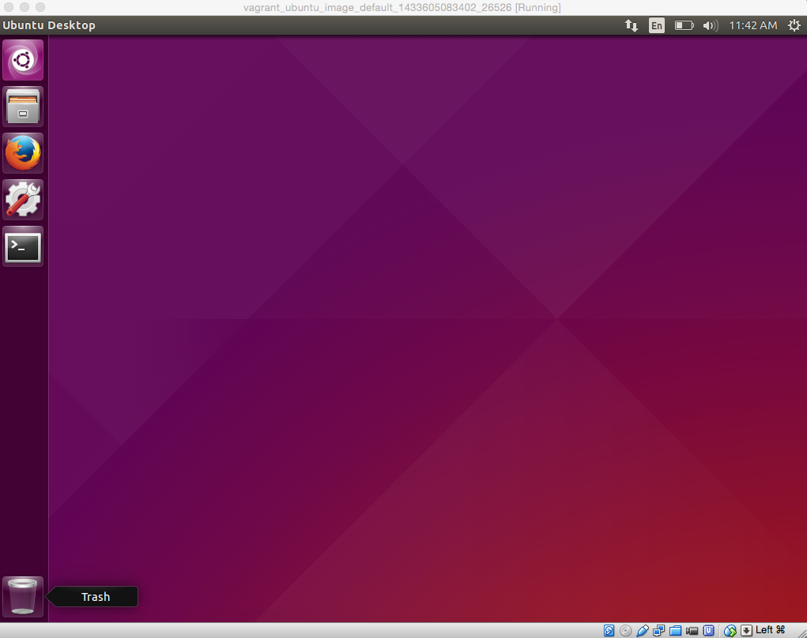

# Linux Bootcamp: From Casual Linux User to Kernel Hacker (Workshop)

Session Info:
[OSCON:Linux Bootcamp: From Casual Linux User to Kernel Hacker](http://www.oscon.com/open-source-2015/public/schedule/detail/41300)

Monday, July 20th 2015 at 9:00am to 12:30pm

## How to use these materials
This GitHub repo contains an Ubuntu installation guide as well as all the workshop exercises.

All workshop exercises can be found [here](workshop).

## Ubuntu Setup
For this workshop, we will use a program called Vagrant to run a full copy of Ubuntu Desktop version 15.04 (the latest and greatest). Vagrant requires that VirtualBox be pre-installed and is a handy tool which allows users to load pre-installed software. If we didn't use Vagrant we'd have to spend a good chunk of the class just installing Ubuntu on VirutalBox which is pretty boring :)

## Prerequsites
1. Free up around 10GB's on your laptop to get started.
1. **Download and install** VirtualBox 4.3.26 for your OS:
http://download.virtualbox.org/virtualbox/4.3.28/VirtualBox-4.3.28-100309-OSX.dmg (mac)
http://download.virtualbox.org/virtualbox/4.3.28/VirtualBox-4.3.28-100309-Win.exe (Windows)
1. **Download and install** Vagrant for your OS: https://dl.bintray.com/mitchellh/vagrant/vagrant_1.7.2.dmg (mac)
https://dl.bintray.com/mitchellh/vagrant/vagrant_1.7.2.msi (Windows)
1. **Download** the Ubuntu_15.04 vagrant image that we have already pre-built from https://www.dropbox.com/s/b1zqdjyka9udkfv/package.box.zip?dl=0 (this is about 1.6Gb so may take a while)

## Setting up Ubuntu with Vagrant

#### Check Vagrant is installed
Check that you have Vagrant installed successfully by running `vagrant --version`. You should see something like `Vagrant 1.7.2`.

#### Download the Ubuntu vagrant image
Unzip the Ubuntu_15.04 image that you previously downloaded.
You should see a file called package.box.

#### Install the Ubuntu box in Vagrant
Open up a terminal and change into the directory to where you unzipped the image.

```bash
$ vagrant box add {boxname} package.box
```
in our case:
```
$ vagrant box add Ubuntu-Desktop-15.04 package.box
```
This installed an Ubuntu box called `Ubuntu-Desktop-15.04` with Vagrant.

#### Init the Vagrant box
```
$ vagrant init {boxname}
```
in our case:
```
$ vagrant init Ubuntu-Desktop-15.04
```
If you list the contents of this directory (`ls`), you'll now see a new file that was created `Vagrantfile`.

#### Enable GUI
We now need to enable the GUI, to do this either replace the `Vagrantfile` created with the one [here](https://raw.githubusercontent.com/GeorgiCodes/linux_bootcamp/master/downloads/vagrant_ubuntu_image/Vagrantfile), or edit the generated `Vagrantfile` by uncommenting the following lines and saving the file:

```bash
    config.vm.provider "virtualbox" do |v|
    v.gui = true
    end
```

#### Spin it up!
Now we've done all the necessary initialization steps to setup Ubuntu with Vagrant, from now on we only need to start it up and shut it down.

The username and password for this Ubuntu image are both `vagrant`.

```bash
$ vagrant up
```
You should now see this:


This should launch a Ubuntu 15.04 Desktop for use throughout the tutorial!

When you want to shut it down run:
```bash
$ vagrant halt
```
